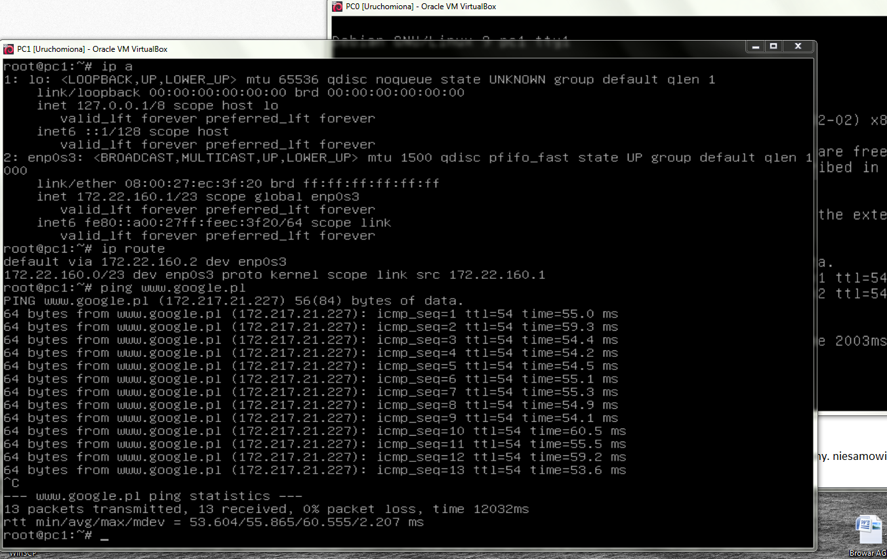

Zadanie 1
---------

1. Zaprojektuj oraz przygotuj prototyp rozwiązania z wykorzystaniem oprogramowania ``VirtualBox`` lub podobnego. 
Zaproponuj rozwiązanie spełniające poniższe wymagania:
   * Usługodawca zapewnia domunikację z siecią internet poprzez interfejs ``eth0`` ``PC0``
   * Zapewnij komunikację z siecią internet na poziomie ``LAN1`` oraz ``LAN2``
   * Dokonaj takiego podziału sieci o adresie ``172.22.128.0/17`` aby w ``LAN1`` można było zaadresować ``500`` adresów natomiast w LAN2 ``5000`` adresów    
   * Przygotuj dokumentację powyższej architektury w formie graficznej w programie ``DIA``
 
-------------------------------------------------------------------------------------------------------------------------

172.22.128.0/17 - Adres do podziału

Na początku obliczyłem maskę na zasadzie 2 do której da mi więcej od zadanej liczby użytkowników.
Potem za pomocą strony http://jodies.de/ipcalc wykalkulowałem drugi adres.

172.22.160.0/23 - LAN 1

172.22.128.0/19 - LAN 2

Podpiąłem sieci w VirtualBox wzorując się na schemacie tzn
PC1 - LAN1
PC2 - LAN2
PC0 - LAN1 LAN2 NAT

PC0:
Włączyłem PC0, sprawdziłem połączenie z internetem pingiem - nie działa.
Sprawdziłem co się dzieje ip a oraz ip route.
Wszedłem w plik interfaces i go edytowałem w nano za pomocą komedy:
nano /etc/network/interfaces

Dodałem interfejs enp0s9 wpisując dwie linijki:
auto enp0s9 
iface enp0s9 inet dhcp
Usunąłem domyślny adres i maskę routingu, zresetowałem maszynę, ping www.google.pl działa!

Dalej żeby możliwe było przesyłanie pakietów z PC1 i PC2 musiałem ustawić ip forwarding.
W tym celu użyłem polecenia nano /etc/sysctl.conf 
Okazało się, że odpowiednia linia była już odkomentowana co oznaczało, że forwarding jest ustawiony!

Następnie ustawiłem routing żeby defaultowo szło na wyjściowy interfejs
ip route, defaultowo miałem 10.0.4.2 dev enp0s9

ip route del default

ip route

ip route add default dev enp0s9

Podpiąłem interfejsy PC1 i PC2 do PC0
ip a add 172.22.160.2/23 dev enp0s3
ip a add 172.22.128.2/19 dev enp0s8

PC1:
Włączyłem PC1, od razu dodałem adres IP komendą: ip a add 172.22.160.1/23 dev enp0s3
Sprawdziłem czy jest połączenie z PC0 komendą: ping 172.22.160.2  ... jest!
Sprawdziłem czy mogę spingować www.google.pl oczywiście, że nie, bo nie ustawiłem routingu
ip route add default via 172.22.160.2 ... dalej nie działa, jeszcze raz zrobiłem wszystko na PC0, nie działało, ale zresetowałem maszynę i pakiety wysyłają się prawidłowo, super!

